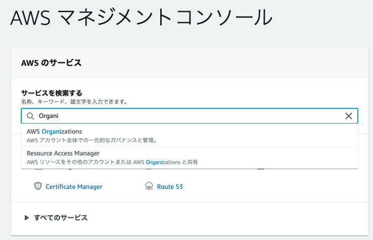
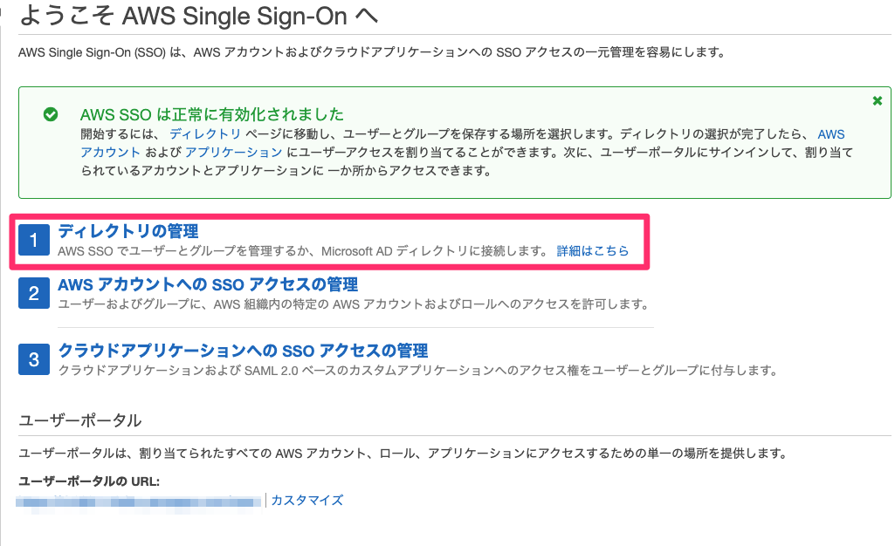
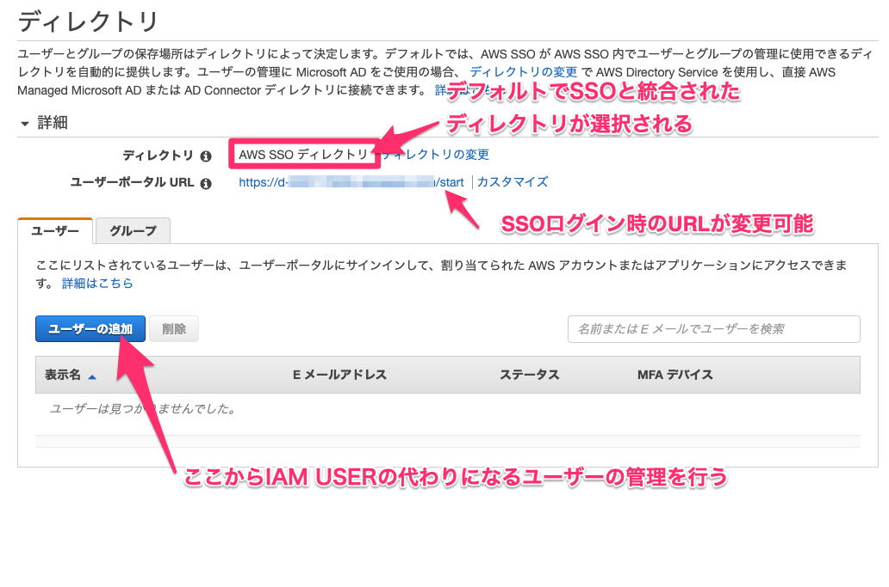
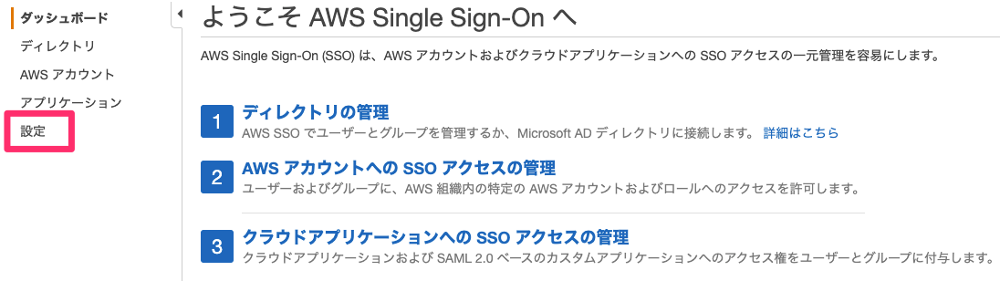
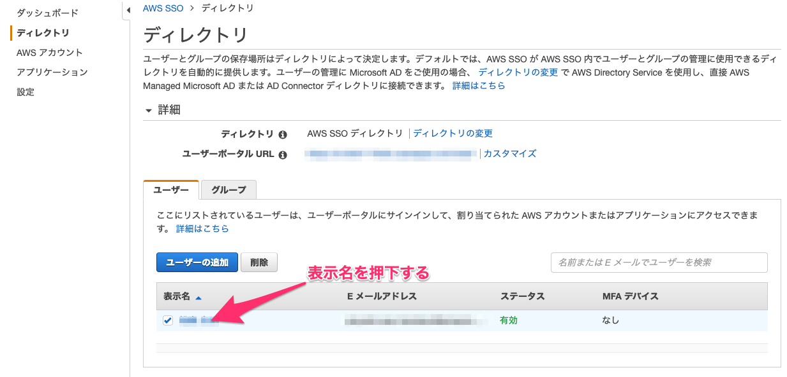
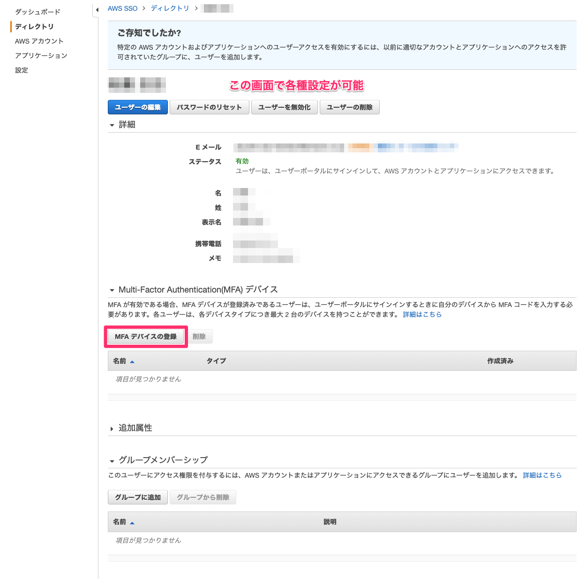
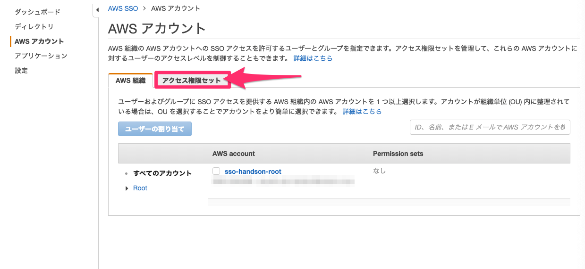
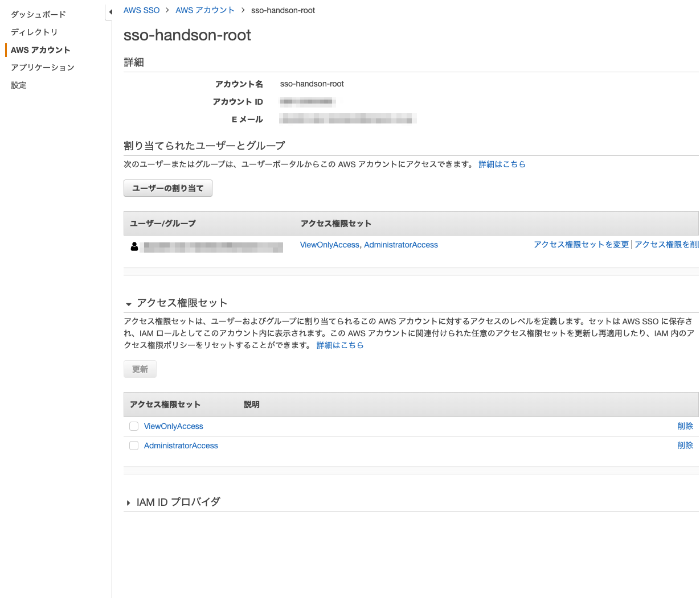
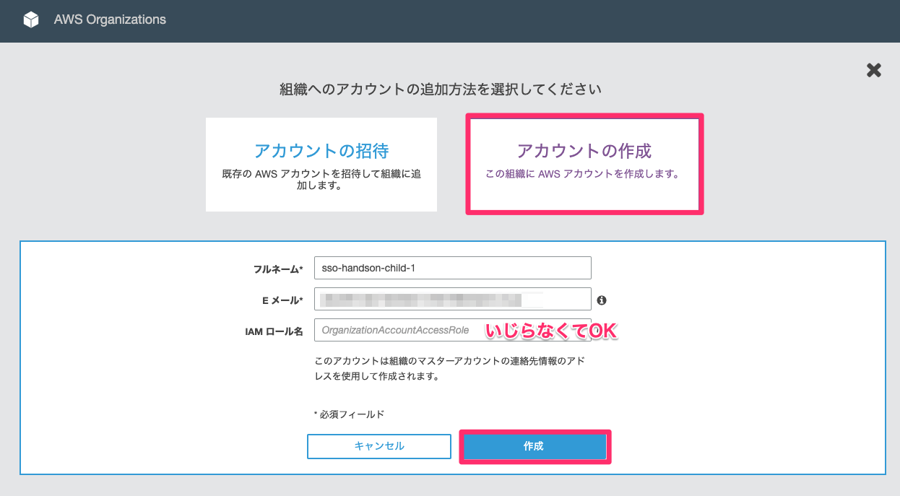

# 資料

本資料はAWSのマルチアカウント管理に使用するAWS SSO環境を構築するためのものです。
ハンズオンの中では実際に複数のアカウントを作成します。
ハンズオンではAWS OrganizationsやAWS IAMなどのサービスを使用します。ハンズオン実施に際して新規にアカウントを取得することを勧めます。

# 前提

アカウントを作成します。
**有効なクレジットカードを保持していることを前提とします。**

アカウント作成時に確認作業が発生します。
手元に電話もしくはSMSを受信できる端末があることを前提とします。

本ハンズオンは新規に取得したアカウントに対して実施するものとして準備しています。
ハンズオンでは以下のサービスを利用します。

- AWS Organizations
- AWS SSO

構築手順は2019/11現在のものです。
画面や表示の更新などにより差異が生じる可能性があります。

WebブラウザはChromeの利用を前提としています。
ブラウザの差異によりハンズオンが実施できない。ということは無いと思いますが、Chrome以外は検証していません。

# アカウントの取得

新規にAWSアカウントを取得します。

1. Webブラウザで https://aws.amazon.com/jp/console/ にアクセスします。
1. 画面右上の”**コンソールにサインイン**”を押下します。
1. マネジメントコンソールへのログイン用画面に遷移します。画面中部の”**新しいAWSアカウントの作成**”を押下します。
1. アカウント情報を入力します
    1. E メールアドレス: 有効なメールアドレスを入力します。過去、AWSアカウントの作成に利用したアドレスは使用できません（エイリアスの仕様が可能です）
    1. パスワード: Rootユーザーのパスワードです。十分に複雑なパスワードを設定し、パスワード管理アプリケーションなどで厳重に管理してください。
    1. AWS アカウント名: アカウント名のエイリアスを指定できます。今回は **sso-handson-root** としました。わかりやすいものを指定してください。
    1. 問題がなければ”**続行**”を押下します。
1. 連絡先情報を入力してください
    1. アカウントの種類：**パーソナル**　を選択する
    1. 電話番号: 有効な電話番号を入力します
    1. 国/地域: **日本** を選択
    1. 住所情報：住所情報を入力してください。（入力は半角英数字）
    1. AWS カスタマーアグリーメント の諸条件を確認済みで、同意する場合はここをチェックしてくださいに同意したらチェックを入れる
    1. 上記が完了したら"**アカウントを作成して続行**"を押下します。
1. 支払先情報の入力。有効なクレジットカード情報を入力してください。
1. 本人確認
    1. SMSか音声電話で本人確認が実施されます任意のチェックボックスにチェックを入れてください。今回は **SMS** を利用しました。
    1. リージョンコードが日本になっていることを確認する
    1. 携帯電話番号を入力する
    1. セキュリティチェックに表示されている文字列を下部の入力欄に入力する
    1. "**SMSを送信する**"を押下する
    1. SMSに届いた認証コードを画面に表示されたテキストボックスに入力し、コードの検証を押下してください。
1. サポートプランの選択
    1. 必要に応じたプランを選択してください。後ほど変更が可能です
    1. ベーシックプランを選択する
画面上部に表示された”**コンソールにサインイン**”を押下してください。
マネジメントコンソールへログインする画面に再び遷移します。
AWS アカウントの E メールアドレスを入力して次へを押下してください。
設定したパスワードを入力して画面中部青色の"**サインイン**"ボタンを押下してマネジメントコンソールへサインインしてください。

**Rootアカウントに対してはMFAの設定など必要なセキュリティアクションを実施してください。**
本ハンズオンでは割愛します。

以後、このセクションで作成したアカウントを**Rootアカウント**と呼称します。

# AWS Organizationsの設定

AWS SSOはAWS Organizationsと密接に連携しています。
このセクションではAWSで複数のアカウントを管理する際に使用するOrganizationsの基本的な設定を実施します。

1. 画面中部の検索窓でOrganizationsを検索し、選択してください。
    
1. 画面中部の"**組織の作成**"を押下します
    1. 確認用のポップアップが表示されるので青色の"**組織の作成**"を押下します。
    1. Rootアカウントを作成する際に使用したメールアドレスに確認用のメールが送付されているので確認してください。
    1. AWS Organizations... から始まる表題のメールにある "Verify your email address"を押下してください。
    1. 再びサインインの画面が表示された場合はサインインしてください。

以上でOrganizationsの設定は完了です。
以後、アカウントの開設がこのOrganizationsから可能になります。
後ほどOrganizationsを利用してアカウントを追加します。

# AWS SSOの設定

Organizationsで管理している複数のAWSアカウントにSSO(Single Sign-On)するための設定を行います。
複数のアカウントへログインする際にはIAMのSwitchロールの利用などが一般的ですが、管理アカウントが増えてくるとログインが煩雑になります。
ここではAWS SSOを利用したマルチアカウントへのSingle Sign-On環境の構築を行います。

AWS SSOは現在下記のリージョンで利用が可能です
- EU (ロンドン)
- EU (アイルランド)
- アジアパシフィック (シンガポール)
- アジアパシフィック (シドニー)
- EU (フランクフルト)
- 米国東部 (バージニア北部)
- 米国東部 (オハイオ)
- カナダ (中部)
- 米国西部 (オレゴン)

2019/11現在では東京リージョンでのサービス提供がないため、別リージョンを使用します。
 **米国西部 (オレゴン)** を本ハンズオンでは使用します。

AWS SSOでは既存のActiveDirectoryに接続してユーザーを管理することができます。
また、AD環境を持っていない場合AWS SSOが提供するディレクトリを用いたユーザー管理が可能です。
本ハンズオンではAWS SSOと統合されたディレクトリを利用します。

1. AWS SSOの画面に遷移します。
1. 一覧からオレゴンを選択して押下してください。
1. 画面中部の "**AWS SSOを有効にする**"を押下してください。
1. 画面上部に表示されている"**ディレクトリの管理**"を押下してください
    
1. 表示されたディレクトリの画面で設定の確認をする。
    
    1. ディレクトリの変更からSSO用のディレクトリとADの利用を選択できます。
    1. ポータルURLからSSOログイン認証時にアクセスするURLを設定することができます。
1. ユーザーのMFA設定を変更する
    1. 画面左のペインから"**設定**"を選択します
        
    1. 画面中部の"**設定**"ボタンを押下します。各種設定を下記の通りに設定します。
        1. ユーザーに Multi-Factor Authentication (MFA) を促す: サインインのたび (常時オン)
        1. ユーザーが登録済みの MFA デバイスをまだ持っていない場合: E メールで送信されるワンタイムパスワードの入力を要求する
        1. MFA デバイスを管理できるユーザー: ユーザーと管理者が MFA デバイスを追加および管理できる
        1. 画面下部の"**設定の保存**"を押下して完了
        
以上でAWS SSOを使用する準備が整いました。
ここからはSSOユーザーを作成していきます。

# ディレクトリにユーザーを作成する

AWS SSOのディレクトリにユーザーを追加します。
今後このユーザーをIAMユーザーの代わりに用いてAWSアカウントにログインを行います。

1. 左ペインの"**ディレクトリ**"を選択
1. ディレクトリ画面下部青色のボタン"**ユーザーの追加**"を押下する
    1. ユーザー詳細を入力する
    1. 画面下部"**グループ**"を押下する
       1. ユーザー管理のためグループの設定が可能です。今回は飛ばします
       1. 画面下部"**ユーザーの追加**"を押下する
       1. 設定したメールアドレスに確認用メールが飛ぶので"Accept invitation"を押下して設定を完了させる
       
本設定では、MFAデバイスの設定が完了するまでは、ID/P＋メール認証が必須になっています。
SSOの管理者もしくはユーザーがSSOディレクトリの画面からMFAデバイスを登録することでOTPが有効になります。
スマートフォンアプリを利用してOTPの管理が可能です。
- [Authy](https://apps.apple.com/jp/app/authy/id494168017)
- [Google Authenticator](https://apps.apple.com/jp/app/google-authenticator/id388497605)

参考にAppleのStoreリンクを記載しましたが、Android端末用も存在します。

# アカウントへのアクセス権限の設定

ユーザーがどういった権限セットでアカウントにログインするのかの設定を行います。
1. 画面左のペインから"**AWSアカウント**"を選択してください
1. 中央のタブで”**アクセス権限セット**”を選択します。
    
1. 既存の職務機能ポリシーを使用を選択します。
1. 職務機能ポリシーを選択からAdministratorAccessを選択します。
1. 画面下部の作成を押下します。
    1. 同様にViewOnlyAccessを作成してください
    
# アカウントに権限を割り当てる
    
1. コンソール画面のタブをアクセス権限セットからAWS組織に切り替えます。
1. sso-handson-rootなどアカウントを作成した際のエイリアス名でアカウントが表示されているはずなので、チェックボックスにチェックを入れます
1. 青色のユーザーの割当を押下します
1. 先程作成したユーザーがいるはずなのでチェックボックスを有効にします
1. 画面下部の次：アクセス権限のセットを押下します
1. 先程作成したAdministratorAccessとViewOnlyAccessが選択できるので両方にチェックを入れます。
1. 画面下部の完了を押下します。

各アカウントに対して、設定したユーザーが設定した権限を選択してログインできるようになります。
このAWSアカウントの画面で指定のアカウントを押下し、どのユーザーがどんなアクセス権限セットでログインできるかを制御することが可能です。

    
# アカウントの追加

Organizationsを用いて管理アカウントを追加します。

1. マネジメントコンソールからOrganizationsに移動します。
1. 画面中央のアカウントの追加を押下します。
   1. 新規にアカウントを追加するのでアカウントの作成を押下します
   1. 表示されるアカウント名とメールアドレスを入力して招待を押下します。メールアドレスはエイリアスが使用できます。
        
       
上記操作でアカウントを追加することができました。
Organization配下のアカウントはAWS SSOで制御が可能です。AWS SSOのAWSアカウント画面で先程追加したアカウントが表示されていることを確認してください。
このアカウントに対して、アカウントに権限を割り当てるのセクションで実行した手順を行うことでこのアカウントに対するログインの制御が可能になります。

